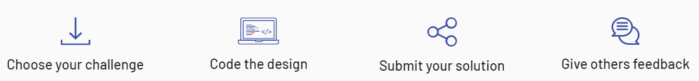

# Frontend Mentor

In this repository, you can see all of my finished Frontend Mentor challenges. And by following this [link](https://stoic-meninsky-7d6f57.netlify.app/) you can check out all of mine completed projects so far.

### What is [Frontend Mentor](https://www.frontendmentor.io/)?

It's a website where you practice by building real-life projects. Improve your front-end coding skills by building real projects Solve real-world HTML, CSS and JavaScript challenges whilst working to professional designs.

### How it works?

#### Choose your [challenge](https://www.frontendmentor.io/challenges)

Have a look through our collection of web designs. Pick one that you feel will be a nice challenge for you at this stage.

#### Code the design

Start the challenge and download all the starter files. We provide all the files you'll need to complete the challenge. Building it is up to you!

#### Submit your solution

Post your solution on the platform for everyone to see and get feedback on your code from other developers in the community.

#### Give others feedback

Thinking critically about other people's code is a crucial skill. Help others while deepening your knowledge by giving feedback on solutions.
