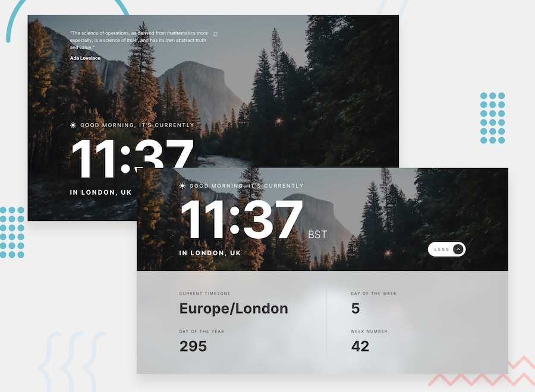

# Frontend Mentor - Clock app solution

Live version can be found [here](https://www.heydusan.com/clockapp/index.html)

## Overview

### The challenge

Users should be able to:

- View the optimal layout for the site depending on their device's screen size
- See hover states for all interactive elements on the page
- Website is also a Progressive Web App (PWA) has an offline support
- View additional information about the date and time in the expanded state
- Be shown the correct greeting and background image based on the time of day they're visiting the site
- Generate random programming quotes by clicking the refresh icon near the quote

### Screenshot

### Links

- Solution URL: [check it on Frontend Mentor](https://www.frontendmentor.io/solutions/clock-app-with-a-support-for-pwa-V3HMXY6U4)
- Live Site URL: [Dusan Milosevic | Clock App](https://www.heydusan.com/clockapp/index.html)

## My process

### Built with

- Semantic HTML5 markup
- CSS custom properties
- Flexbox
- CSS Grid
- Mobile-first workflow
- PWA

## Author

- Website - [Dusan Milosevic | Porfolio ](https://www.heydusan.com/)
- Frontend Mentor - [@demanderbag](https://www.frontendmentor.io/profile/DEmanderbag)
- Twitter - [@demanderbag\_](https://www.twitter.com/demanderbag_)
