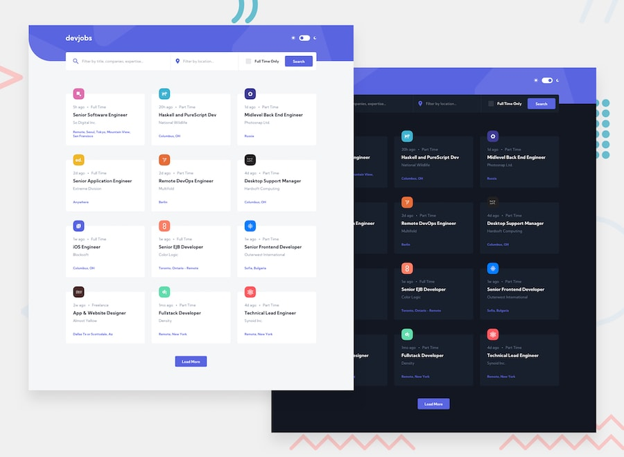

# Frontend Mentor - GitHub Jobs API

Live version can be found [here](https://stoic-meninsky-7d6f57.netlify.app/githubjobs/)

## Welcome! 👋

**To do this challenge, you need a solid understanding of HTML, CSS, and JavaScript.**

## The challenge

Your challenge is to build out this jobs board using the [GitHub Jobs API](https://jobs.github.com/api) data and get it looking as close to the design as possible.

Your users should be able to:

- View the optimal layout for each page depending on their device's screen size
- See hover states for all interactive elements throughout the site
- View all jobs currently live on the GitHub Jobs API
- Be able to click a job from the index page so that they can read more information and apply for the job
- **Bonus**: Have the correct color scheme chosen for them based on their computer preferences. _Hint_: Research `prefers-color-scheme` in CSS.

Want some support on the challenge? [Join our Slack community](https://www.frontendmentor.io/slack) and ask questions in the **#help** channel.

## Sharing your solution

There are multiple places you can share your solution:

1. Submit it on the platform so that other users will see your solution on the site. Here's our ["Complete guide to submitting solutions"](https://medium.com/frontend-mentor/a-complete-guide-to-submitting-solutions-on-frontend-mentor-ac6384162248) to help you do that. **With these premium challenges please be sure not to upload the Sketch file to GitHub when you're submitting to the platform and sharing it around.**
2. Share your solution page in the **#finished-projects** channel of the [Slack community](https://www.frontendmentor.io/slack).
3. Tweet [@frontendmentor](https://twitter.com/frontendmentor) and mention **@frontendmentor** including the repo and live URLs in the tweet. We'd love to take a look at what you've built and help share it around.

**Have fun building!** 🚀
